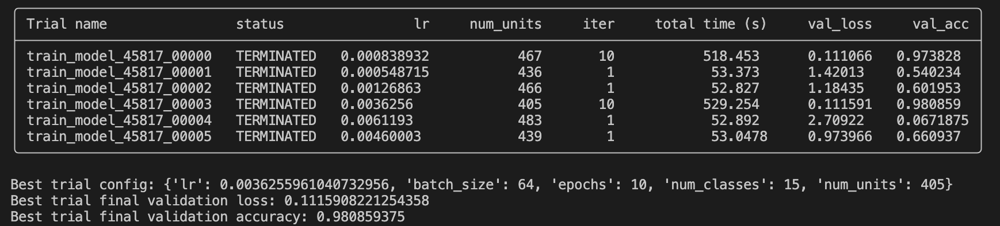

# Session 2
Implement a full project training on [Chinese MNIST](https://www.kaggle.com/gpreda/chinese-mnist) with hyperparameter tuning.

# Solution

Install the dependencies
```
pip install -r session-2-sol/requirements.txt
```

To run the project with hyperparameter tuning, run

```
python session-2-sol/main_hyperparam_optimize.py
```

The performance achieved on the validation dataset was 0.97 and in the test dataset was 0.99 with this config: `{'lr': 0.003112679759787541, 'batch_size': 64, 'epochs': 10, 'num_classes': 15, 'num_units': 500}`

```
Best trial test set: loss=0.04 acc=0.99
```



By using the `ASHAScheduler` scheduler, three of the trials were stoped in a few iterations after no improving the first one.


