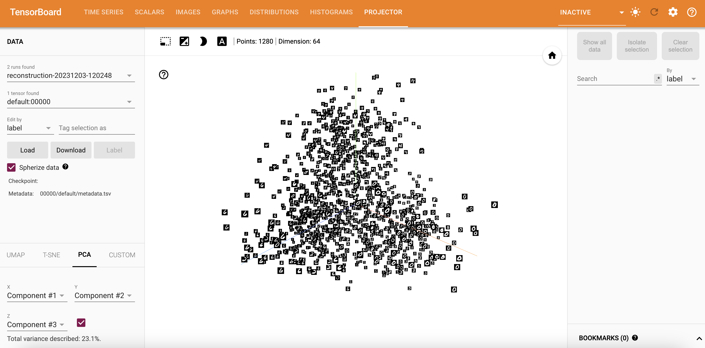

# Session 5
Monitoring using Tensorboard and WandB. 

In this session we will solve two very simple tasks: reconstruction and classification
on a subset of the MNIST dataset. In this hands-on the training itself it's not the most important, therefore with only 
5 epochs trained in CPU it is enough to visualize everything we want in the Tensorboard and Wandb dashboards.
## Installation
### With Conda
Create a conda environment by running
```
conda create --name aidl-session-5 python=3.8
```
Then, activate the environment
```
conda activate aidl-session-5
```
and install the dependencies
```
pip install -r requirements.txt
```
## Running the project

To run the project, run
```
python main.py --task reconstruction --log_framework tensorboard
python main.py --task reconstruction --log_framework wandb
python main.py --task classification --log_framework tensorboard
python main.py --task classification --log_framework wandb
```
To run the project with different arguments, run
```
python main.py --task reconstruction --log_framework tensorboard --latent_dims 64 --n_epochs 10
```

## TODO
1. Get familiarized with the code in main.py and run_reconstruction/classification.py
2. Start by completing the TODO's in the tensorboard_TODO.py file. Only those required to solve the reconstruction task. 
3. Make sure that everything desired is logged (scalars, graph, weights, gradients, embeddings and reconstructed images).
4. Then do the same for the classification task.
5. Repeat steps 2, 3 and 4, but this time using the WandB framework. The only thing that won't be logged is the graph of the model.
6. [OPTIONAL] If you have time, try to do something similar to what is done in [this report](https://wandb.ai/juanjo3ns/mnist_colab/reports/MNIST_COLAB--Vmlldzo1MDIxOTE). Feel free to innovate.

## Results

**Tensorboard**

